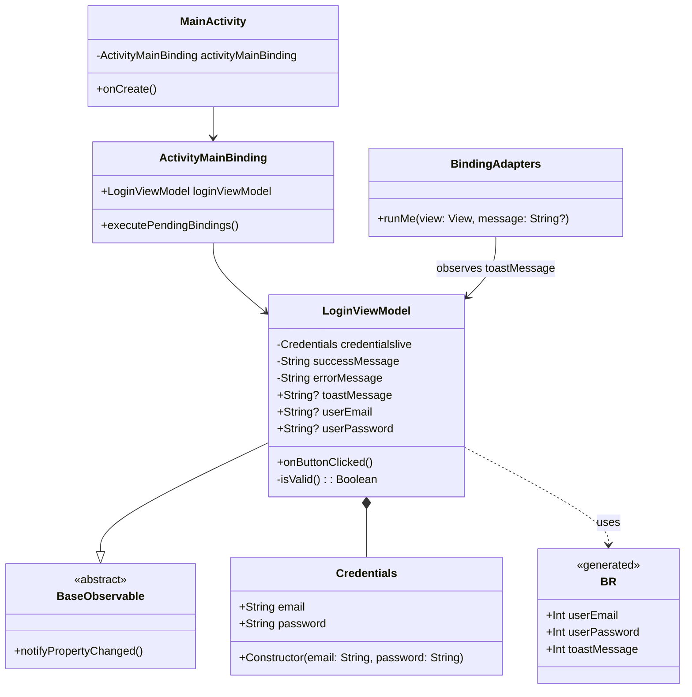

# UI-Utils-Rho-Studio
Reusable fragments

```mermaid
classDiagram
    class Credentials {
        +String email
        +String password
        +Constructor(email: String, password: String)
    }

    class LoginViewModel {
        -Credentials credentialslive
        -String successMessage
        -String errorMessage
        +String? toastMessage
        +String? userEmail
        +String? userPassword
        +onButtonClicked()
        -isValid(): Boolean
    }

    class BaseObservable {
        <<abstract>>
        +notifyPropertyChanged()
    }

    class BR {
        <<generated>>
        +Int userEmail
        +Int userPassword
        +Int toastMessage
    }

    class ActivityMainBinding {
        +LoginViewModel loginViewModel
        +executePendingBindings()
    }

    class MainActivity {
        +onCreate()
        -ActivityMainBinding activityMainBinding
    }

    class BindingAdapters {
        +runMe(view: View, message: String?)
    }

    LoginViewModel --|> BaseObservable
    LoginViewModel *-- Credentials
    LoginViewModel ..> BR : uses
    MainActivity --> ActivityMainBinding
    ActivityMainBinding --> LoginViewModel
    BindingAdapters --> LoginViewModel : observes toastMessage
```